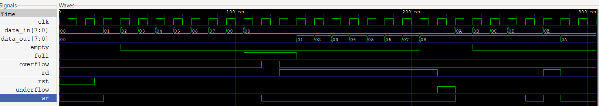

# Synchronous FIFO Design and Verification

## Overview

This project implements and verifies a parameterized **Synchronous FIFO** in **Verilog HDL**, configured with an **8-bit data width** and **8-depth memory**. The design supports synchronous read/write operations, full and empty status indication, and overflow/underflow detection. Functional verification was performed using a self-checking testbench and assertion-based verification.

---

## Key Features

* Parameterized FIFO architecture
* Configurable data width and FIFO depth
* Synchronous read and write operations
* Full and Empty status flags
* Overflow and Underflow detection
* Self-checking verification environment
* Assertion-based verification
* Waveform analysis using GTKWave

---

## Design Specifications

| Specification   | Value               |
| --------------- | ------------------- |
| Data Width      | 8-bit               |
| FIFO Depth      | 8 entries           |
| Read Operation  | Synchronous         |
| Write Operation | Synchronous         |
| Reset           | Active-Low          |
| Status Flags    | Full, Empty         |
| Error Flags     | Overflow, Underflow |

---

## Verification

The design was verified for the following functional scenarios:

* Reset functionality
* Sequential write operations
* Sequential read operations
* FIFO full condition
* FIFO empty condition
* Overflow handling
* Underflow handling
* Simultaneous read/write operation
* Assertion-based verification

---

## Simulation Waveform

  

---

## Tools Used

* Verilog HDL
* Icarus Verilog
* GTKWave
* Visual Studio Code

---

## Future Enhancements

* Concurrent SystemVerilog Assertions (SVA)
* UVM-based Verification Environment
